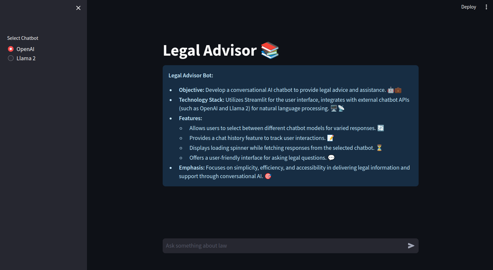

# ⚖️ Legal Query AI Assistant

## Overview
The **Legal AI Assistant** utilizes **Large Language Models (LLM)** and **Retrieval-Augmented Generation (RAG)** to assist users with legal queries by retrieving and summarizing relevant legal documents, providing quick and accurate responses for decision-making.



## Key Features
- Supports **OpenAI GPT** or **LLaMA** for language understanding.
- Efficient legal document retrieval with **vector databases**.
- Combines **RAG** to ensure response accuracy.
- User-friendly design for seamless interaction.

## How to Use
1. Clone the repository.
2. Install dependencies: `pip install -r requirements.txt`.
3. Start the chatbot: `python app.py`.
4. Submit legal queries and receive instant answers.

## Technologies
- LLM (OpenAI GPT / LLaMA)
- Vector Databases
- RAG
- Python

## Installation
```bash
git clone https://github.com/your_username/legal-chatbot.git
cd legal-chatbot
pip install -r requirements.txt
python app.py
